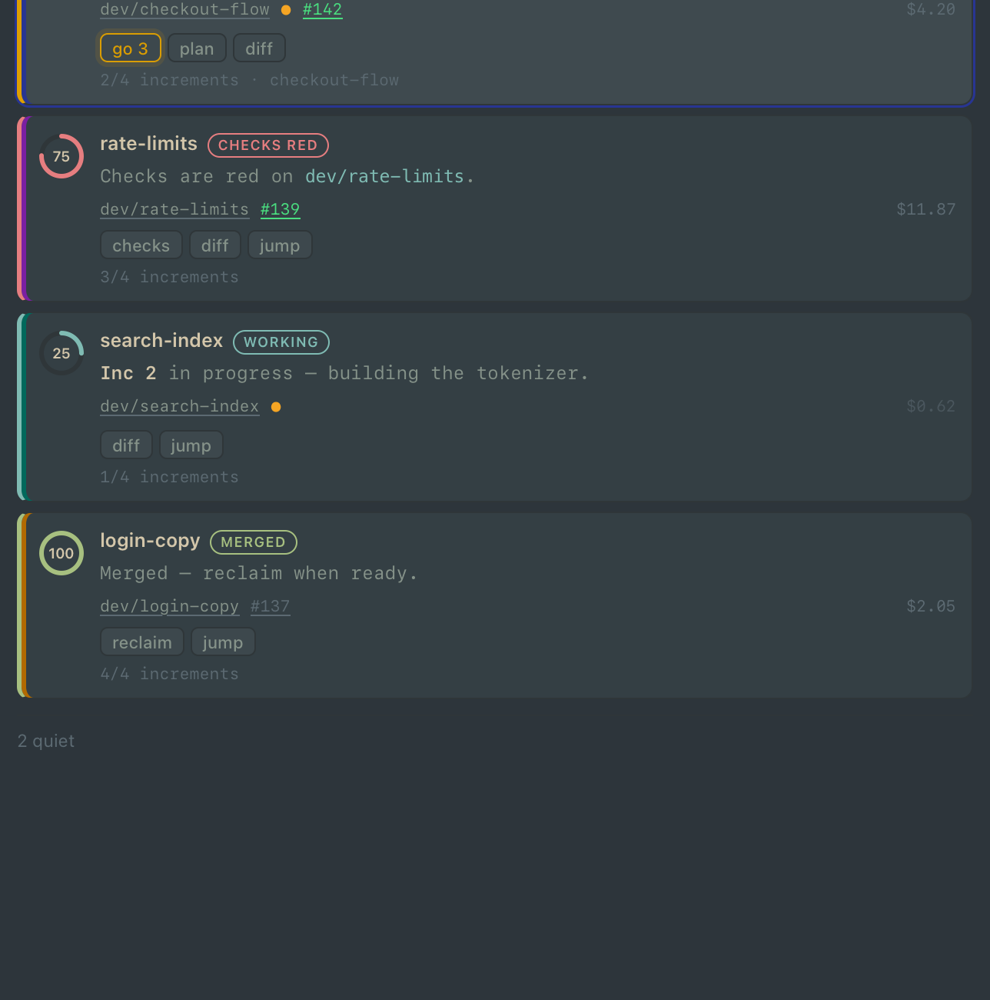
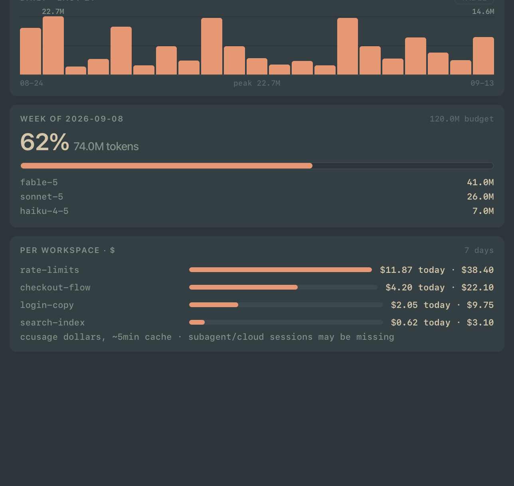
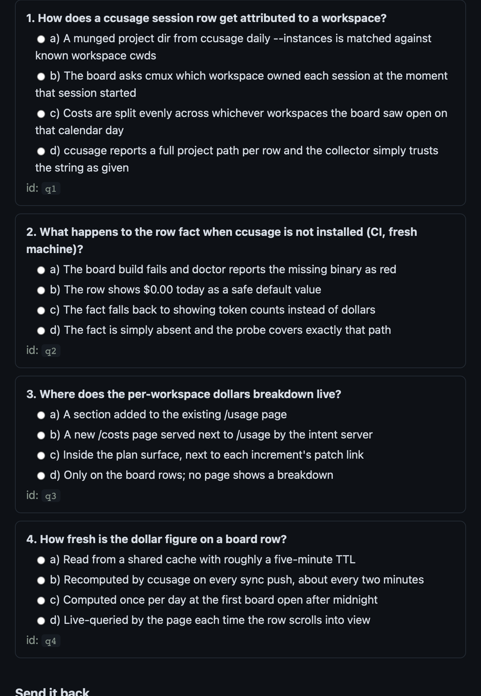

# seamux

Run a fleet of Claude Code agents from one screen. seamux adds two things to
[cmux](https://cmux.io):

- **crew** — a Dock board that ranks your worktrees by who needs you right
  now, so a dozen parallel agents stay legible.
- **deep-plan** — a Claude Code skill that turns "make a plan" into a
  reviewable page with a quiz, then blocks the agent from editing until you
  approve each increment.

It scales with you. Out of the box it needs nothing but git and GitHub — a
laptop of hobby repos is fully served. When your projects have more — Jira,
GitHub Issues, a Datadog or Splunk stack — setup asks, and the board and the
planner put them to work. With Remote Control on, the same fleet shows up in
the Claude phone app.

## What it looks like

**The board.** One row per worktree, ordered by urgency: waiting on you,
broken, working, done, quiet. Each row shows its plan's gate, a progress
dial, the branch and PR (both clickable), today's spend, and one-tap chips —
`go 3` approves a plan increment without leaving the Dock. The cat naps when
nothing needs you.



**Usage.** Tokens against your 5-hour and weekly budgets, a 21-day history,
and per-workspace dollars — so the worktree quietly burning money stands out.



**A plan under review.** deep-plan renders the agent's plan as a page:
context, decisions, cited evidence, diagrams, increments — and a short quiz
that checks you and the plan actually agree. Answer on the page, highlight
text to pin comments, hit **Copy for session**, paste it back. Until the quiz
passes and you say `go`, the agent cannot edit anything in that worktree.



*(Real renders of the shipped pages, loaded with demo data.)*

## Setup

### What you need

| | why | without it |
|---|---|---|
| macOS | cmux and the Dock are mac-only | nothing works |
| [cmux](https://cmux.io) nightly | the board lives in cmux's web Dock | files install, nothing shows |
| `python3` + `node` | board, intent server, probes, deep-plan | install refuses |
| Claude Code | the agents this is all for | not much point |
| `gh` *(optional)* | PR and checks chips on rows | those chips stay blank |
| `ccusage` *(optional)* | spend on rows and `/usage` | cost surfaces are absent |

### Install

```sh
git clone https://github.com/rickykoter/seamux ~/code/seamux
cd ~/code/seamux
./install.sh
```

It asks which repo your worktrees come from (or pass `--main-repo PATH`),
copies everything into place (an existing install is backed up first),
fetches a pinned, checksum-verified `mermaid.min.js`, and wires the cmux
config and Claude settings. The settings merge is additive — it never
rewrites anything it didn't add, and backs up `settings.json` first.

First interactive run, it also asks which integrations this machine uses.
Answers stick across re-installs; everything stays off until you say
otherwise. Other flags: `--dry-run`, `--check`, `--uninstall`, `--force`,
`--no-<piece>` to skip parts, and `--with-jira=SITE` /
`--with-github-issues` / `--with-observability=STACK` /
`--no-integrations` for scripted installs.

### Integrations (all optional)

- **Jira** — a ticket key in your branch name becomes a state-colored chip
  on the row; click it to open `PROJ-123` in your Jira. `crew doctor` only
  checks `acli` if you turned this on.
- **GitHub Issues** — the issue a PR closes (or a `123-…` branch names)
  gets its own chip, riding the `gh` poll crew already makes.
- **Observability-aware planning** — tell seamux about your Datadog or
  Splunk (per-repo `.seamux/observability.json`, or the machine-wide
  answer), and deep-plan reads your monitors, dashboards and runbooks
  before it drafts a plan. What exists gets cited; what's missing becomes
  plan work — new instrumentation, a monitor definition you import, a
  runbook section. It only ever reads: changes arrive as artifacts you
  review and apply, never as API writes.

Declining costs nothing: no doctor nags, no dead chips, no config to
maintain.

### Check it worked

```sh
crew doctor                                      # everything green
node ~/.config/cmux/crew/board/board_probe.mjs
node ~/.claude/skills/deep-plan/probe.mjs
```

Open the board with `cmux sidebar open crew` or the Dock button. New Claude
Code sessions pick up the hooks; already-running ones don't.

Then try it: ask Claude for a "deep plan" of any change. You'll get the
review page, the quiz, and the per-increment gate.

### Uninstall

```sh
./install.sh --uninstall
```

Puts cmux's config back, moves the crew tree to a timestamped backup, removes
the skill and shim, and unwires only the settings it added. It deliberately
keeps `guard_bash.sh` (a safety rail should outlive its installer) and all
your plan state.

## The repo is the source of truth

Edit here, then `./install.sh` to sync. If you edited a live file instead,
`./install.sh --check` finds it — copy the change back into the repo, commit,
reinstall. (The five `crew/bin` files that bake your main-repo path get it
reverse-substituted to `__MAIN_REPO__`.)

You don't have to remember this: the installer records the repo path, and
`crew doctor` runs the drift check every time — drift is a red check, not a
discipline.

## Computer Use (optional)

cmux's Computer Use driver lets agents drive the browser and other apps in
the background. crew works fine without it; `crew doctor` just notes whether
it's set up.

1. In the cmux desktop app, open **Settings → Computer Use** (or the
   onboarding banner). A half-finished setup shows up to agents as "Computer
   Use onboarding is still in progress".
2. Approve the two macOS permission prompts for the cmux helper —
   **Accessibility** and **Screen Recording**. Approve them from cmux's own
   dialogs; if one was dismissed earlier, flip it in System Settings →
   Privacy & Security. Restart cmux if Screen Recording doesn't register.
3. Finish the wizard's self-test, then re-run `crew doctor`.

## Security notes — worth reading before you rely on them

- **The deep-plan gate is a discipline tool, not a security boundary.** It
  blocks the ordinary edit paths so an agent can't wander ahead of your
  go-ahead; a determined process (or a determined agent) can route around a
  PreToolUse hook. Use it to keep honest work honest — not to contain
  something you don't trust.
- **`crew-sandbox` copies your Claude login out of the macOS Keychain into
  the sandbox as a plaintext `.credentials.json`.** That's the only way a
  sandboxed session can be signed in, it's deliberate, and it's a real
  trade-off: anything with access to that sandbox's filesystem can read the
  token, and a token rotated inside the sandbox doesn't rotate the Keychain
  copy. Skip the sandbox feature if that trade bothers you.
- The board's intent server binds to `127.0.0.1` and requires a per-boot
  token (0600) on every mutating route — but any local process running as
  you can read that token. It controls cmux, which such a process could
  drive anyway; just don't extend it beyond loopback.

## Layout

| path | what |
|---|---|
| `crew/` | installed to `~/.config/cmux/crew` (see `crew/README.md`) |
| `deep-plan/` | installed to `~/.claude/skills/deep-plan` (see its `SKILL.md`) |
| `claude/` | statusline, guard hook, settings merger |
| `bin/deep-plan.shim` | installed to `~/.local/bin/deep-plan` |
| `docs/` | dev history, test notes, adoption audit, README images — not installed |

Never committed: rendered cmux configs, deep-plan state and keys, the mermaid
blob, your `~/.claude/settings.json`.
