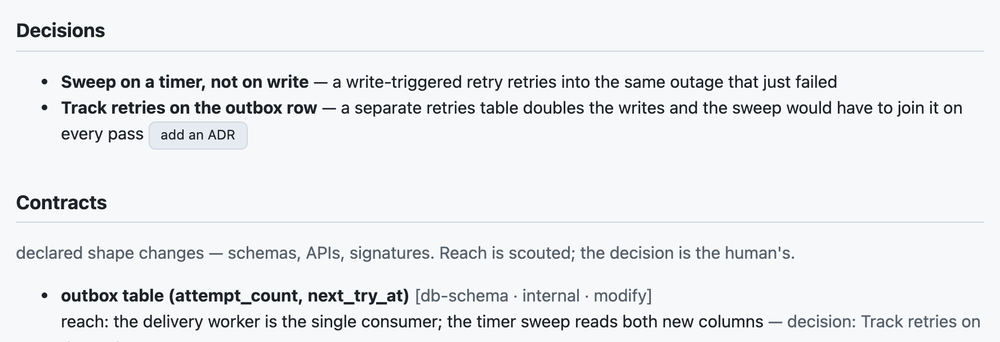
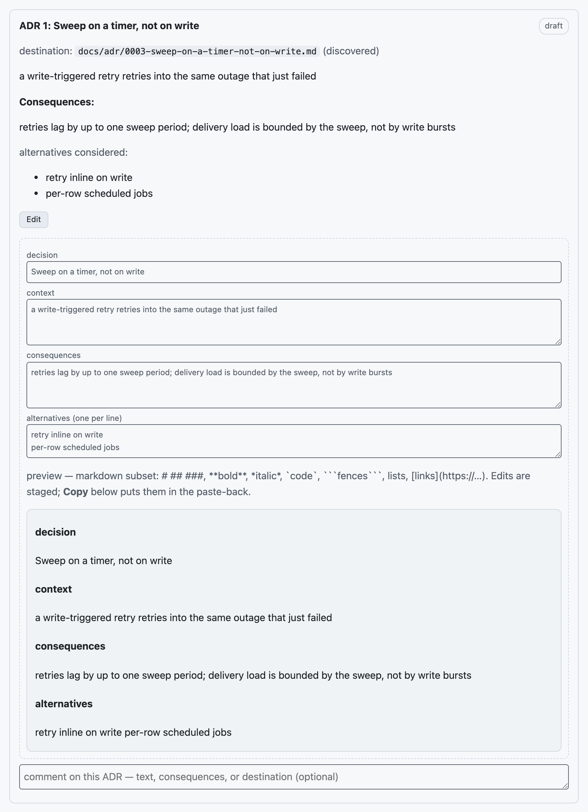

# seamux

Run a fleet of Claude Code agents from one screen. seamux adds two things to
[cmux](https://cmux.io):

- **crew** — a Dock board that ranks your worktrees by who needs you right
  now, so a dozen parallel agents stay legible.
- **deep-plan** — a Claude Code skill that turns "make a plan" into a
  reviewable page with a quiz, then blocks the agent from editing until you
  approve each increment.

It scales with you. Out of the box it needs nothing but git and GitHub — a
laptop of hobby repos is fully served. When your projects have more — Jira,
GitHub Issues, a Datadog or Splunk stack — setup asks, and the board and the
planner put them to work. With Remote Control on, the same fleet shows up in
the Claude phone app.

## What it looks like

**The one-minute tour.** A scripted replay of a working afternoon — the board
re-ranking as agents finish and questions arrive, the `/usage` dashboard, and
a deep-plan review with its alignment quiz:

https://github.com/user-attachments/assets/ba0c9f94-0f5a-4eb7-ae2c-e924a60e817c

_Note: the demo uses mock data and shows panes as standalone; with actual use, you can compose these CMUX panes alongside your Claude Code and other terminals._

**The board.** One row per worktree, ordered by urgency: waiting on you,
broken, working, done, quiet. Each row shows its plan's gate, a progress
dial, the branch and PR (both clickable), today's spend, and one-tap chips —
`go 3` approves a plan increment without leaving the Dock. The cat naps when
nothing needs you.


**Usage.** Tokens against your 5-hour and weekly budgets, a 21-day history,
and per-workspace dollars — so the worktree quietly burning money stands out.


**Cache.** Every prompt rides a serverside cache; break it and the next
prompt re-caches your whole context at a write premium. Most breaks are
just a session left idle past the cache's lifetime — five minutes or an
hour, depending on billing — invisible until the bill. So the
status line shows a small freshness clock (`🧊 42m`), a desktop
notification fires a minute before an idle session goes stale, and when a
turn does break the cache you're told at once — how many tokens re-cached
and why (compaction, a model switch, an idle gap). `/usage` keeps the
running tally: re-cached tokens this week, causes, and the sessions that
cost the most. Detection is local — transcripts, not API calls — and the
TTL is read from your billing mode and settings, never guessed.

What to do with a warning: a break you already took is sunk — you only
pay the re-cache if you prompt again, so a session that was nearly done
can just be left to lapse. A cold cache is also the cheap moment for the
disruptive stuff (switching model, toggling a plugin, upgrading), since
each of those would have broken it anyway. And the stale warning is
worth answering only with a prompt you meant to send — a cache read
costs about a tenth of the normal input price, a re-write up to double
it, so sending the next real
step a minute early is near-free insurance, while prompting just to keep
a cache warm is spending real tokens to protect hypothetical ones.

**A plan under review.** deep-plan renders the agent's plan as a page:
context, decisions, cited evidence, diagrams, increments — and a short quiz
that checks you and the plan actually agree. Answer on the page, highlight
text to pin comments, hit **Copy for session**, paste it back. Until the quiz
passes and you say `go`, the agent cannot edit anything in that worktree.


**Contracts.** If the plan changes the shape of anything — a schema, an API,
a method signature, an event, a config surface — it has to say so in the
spec's `contracts` block. Every entry names the decision that owns it (the
renderer refuses an orphan) and its reach: who consumes the surface, found by
actually looking rather than recalled from memory. Crossing a service
boundary raises the bar — the owning decision must be an ADR, or the entry
carries a written waiver. Grading checks coverage too: a contract whose
decision has no quiz question fails `deep-plan grade` before it reads a
single answer.



**ADRs.** Some decisions outlive the plan that made them. Flag one as `adr`
during planning and it becomes an Architecture Decision Record headed for
the repo, not just the plan page. The renderer works out where it belongs —
your `.seamux/adr.json` if you have one, otherwise the ADR tree nearest the
files being changed, otherwise `docs/adr` — and reserves the next number, so
the draft shows its real destination up front. Each card has an **Edit**
button: change any field right on the page, watch the markdown preview, and
the edits ride the same **Copy for session** paste-back as your quiz
answers. A decision that wasn't flagged gets an **add an ADR** chip. The
repo itself is only touched after the check passes, by `deep-plan adr apply
<slug>` — marked Accepted and dated on the way in, and safe to run twice.
Prefer MADR over the default Nygard style, or have your own template? Point
`.seamux/adr.json` at it.



**The challenge step.** The first thing the planner questions is the goal.
It restates it in its own words, spells out the assumptions riding along,
and puts the strongest counter-argument to you directly: maybe the simpler
fix is X, maybe that symptom usually means Y, maybe this isn't worth doing
at all. A goal you've confirmed plans faster and better than one the agent
assumed. The step is mandatory — the only way past it is telling the agent
to skip the challenge.

**Scouted fan-out.** Between reading the code and writing the spec, the
planner sends out cheap sub-agents: one for each claim it isn't sure of,
one for each contract surface the plan will touch. They come back with the
callers, consumers, and schema reach. What a scout confirms goes into the
plan's verified facts with a citation; what it can't stays listed as a
risk. Nothing is quietly promoted from hunch to fact.

*(Real renders of the shipped pages, loaded with demo data.)*

## Setup

### What you need

| | why | without it |
|---|---|---|
| macOS | cmux and the Dock are mac-only | nothing works |
| [cmux](https://cmux.io) nightly | the board lives in cmux's web Dock | files install, nothing shows |
| `python3` + `node` | board, intent server, probes, deep-plan | install refuses |
| Claude Code | the agents this is all for | not much point |
| `gh` *(optional)* | PR and checks chips on rows | those chips stay blank |
| `ccusage` *(optional)* | spend on rows and `/usage` | cost surfaces are absent |
| [TypeSafe](https://typesafe.ai) key *(optional)* | judgment calls: turn-end questions, board ranking, plan citation checks | those judgments simply don't happen |

### Install

```sh
git clone https://github.com/rickykoter/seamux ~/code/seamux
cd ~/code/seamux
./install.sh
```

It asks which repo your worktrees come from (or pass `--main-repo PATH`),
copies everything into place (an existing install is backed up first),
fetches a pinned, checksum-verified `mermaid.min.js`, and wires the cmux
config and Claude settings. The settings merge is additive — it never
rewrites anything it didn't add, and backs up `settings.json` first.

First interactive run, it also asks which integrations this machine uses.
Answers stick across re-installs; everything stays off until you say
otherwise. Other flags: `--dry-run`, `--check`, `--uninstall`, `--force`,
`--no-<piece>` to skip parts, and `--with-jira=SITE` /
`--with-github-issues` / `--with-observability=STACK` /
`--no-integrations` for scripted installs.

### Integrations (all optional)

- **Jira** — a ticket key in your branch name becomes a state-colored chip
  on the row; click it to open `PROJ-123` in your Jira. `crew doctor` only
  checks `acli` if you turned this on.
- **GitHub Issues** — the issue a PR closes (or a `123-…` branch names)
  gets its own chip, riding the `gh` poll crew already makes.
- **Observability-aware planning** — tell seamux about your Datadog or
  Splunk (per-repo `.seamux/observability.json`, or the machine-wide
  answer), and deep-plan reads your monitors, dashboards and runbooks
  before it drafts a plan. What exists gets cited; what's missing becomes
  plan work — new instrumentation, a monitor definition you import, a
  runbook section. It only ever reads: changes arrive as artifacts you
  review and apply, never as API writes.

- **TypeSafe** — unlike the others, this one isn't asked at setup: putting
  a key on the machine (`$TYPESAFE_API_KEY`, or the first line of
  `~/.config/typesafe/api-key`) turns it on, and removing it turns it off.
  It buys three judgment calls that plain code can't make. When a turn ends
  on "should I do A or B?", crew notices and files the row under "Needs
  you" instead of letting it pass as finished. The board learns which rows
  matter most: a session that stopped on an error it couldn't get past
  wilts, and rows within a tier are ordered by how urgently the last
  message needs you. And when deep-plan renders a plan, each cited
  `path:line` is checked against the file it names — a citation that
  contradicts its claim gets a warning on the spot.

  The rules stay in code; TypeSafe only answers narrow questions, and the
  answers arrive in the background — no Claude turn and no board refresh
  ever waits on the network. What leaves the machine is small and spelled
  out: the last 4,000 characters of a finished turn's closing message, or
  a plan claim with the few lines it cites. On any failure — no key, no
  network, an odd answer — everything behaves exactly as it does without
  TypeSafe. Thresholds live in `integrations.json` and scores log to
  `~/.cache/cmux-crew/asked.log` so you can tune them; `{"typesafe":
  {"enabled": false}}` switches it off with the key still in place.

Declining costs nothing: no doctor nags, no dead chips, no config to
maintain.

### Check it worked

```sh
crew doctor                                      # everything green
node ~/.config/cmux/crew/board/board_probe.mjs
node ~/.claude/skills/deep-plan/probe.mjs
```

Open the board with `cmux sidebar open crew` or the Dock button. New Claude
Code sessions pick up the hooks; already-running ones don't.

Then try it: ask Claude for a "deep plan" of any change. You'll get the
review page, the quiz, and the per-increment gate.

### Uninstall

```sh
./install.sh --uninstall
```

Puts cmux's config back, moves the crew tree to a timestamped backup, removes
the skill and shim, and unwires only the settings it added. It deliberately
keeps `guard_bash.sh` (a safety rail should outlive its installer) and all
your plan state.

## The repo is the source of truth

Edit here, then `./install.sh` to sync. If you edited a live file instead,
`./install.sh --check` finds it — copy the change back into the repo, commit,
reinstall. (The five `crew/bin` files that bake your main-repo path get it
reverse-substituted to `__MAIN_REPO__`.)

You don't have to remember this: the installer records the repo path, and
`crew doctor` runs the drift check every time — drift is a red check, not a
discipline.

### If you are on usage-based billing

The board, `/usage` and the status line all assume a subscription by default:
the constraint is the 5h window, and money is not the question. If you pay per
token that is the wrong framing — there is no window limit, and the month is
what binds. Set:

```json
// ~/.config/cmux/crew-local/config.json
{ "billing": "usage", "monthBudget": 3500 }
```

The status line becomes month-to-date spend against that budget with a pace
figure, and `/usage` leads with the month and speaks dollars throughout rather
than tokens. Absent, nothing changes.

A file rather than an env var because the status line and the intent server are
spawned by parents that never source a shell rc — the full story is in
`crew/board/README.md`. `CREW_BILLING` / `CREW_MONTH_BUDGET` still override for
a one-off, and `crew doctor` reports which mode is in force.

Two things are yours and are never synced: `integrations.json`, and the
machine-local overlay at `~/.config/cmux/crew-local` — an executable
`crew-spec`, plus `cmux.json` / `dock.json` fragments that deep-merge over the
package's templates. That is where a company-shaped test harness or a private
repo's colour belongs, and it survives every reinstall.

`docs/SYNCING.md` has the rest: which path belongs to whom, the traps that have
actually bitten (`--main-repo` must be shell-expanded; a dry run cannot prove
the substitution; `crew apply` takes no backup once it has run here), and what
to check before installing over a live tree that has files the repo never had.

## Computer Use (optional)

cmux's Computer Use driver lets agents drive the browser and other apps in
the background. crew works fine without it; `crew doctor` just notes whether
it's set up.

1. In the cmux desktop app, open **Settings → Computer Use** (or the
   onboarding banner). A half-finished setup shows up to agents as "Computer
   Use onboarding is still in progress".
2. Approve the two macOS permission prompts for the cmux helper —
   **Accessibility** and **Screen Recording**. Approve them from cmux's own
   dialogs; if one was dismissed earlier, flip it in System Settings →
   Privacy & Security. Restart cmux if Screen Recording doesn't register.
3. Finish the wizard's self-test, then re-run `crew doctor`.

## Security notes — worth reading before you rely on them

- **The deep-plan gate is a discipline tool, not a security boundary.** It
  blocks the ordinary edit paths so an agent can't wander ahead of your
  go-ahead; a determined process (or a determined agent) can route around a
  PreToolUse hook. Use it to keep honest work honest — not to contain
  something you don't trust.
- **`crew-sandbox` copies your Claude login out of the macOS Keychain into
  the sandbox as a plaintext `.credentials.json`.** That's the only way a
  sandboxed session can be signed in, it's deliberate, and it's a real
  trade-off: anything with access to that sandbox's filesystem can read the
  token, and a token rotated inside the sandbox doesn't rotate the Keychain
  copy. Skip the sandbox feature if that trade bothers you.
- The board's intent server binds to `127.0.0.1` and requires a per-boot
  token (0600) on every mutating route — but any local process running as
  you can read that token. It controls cmux, which such a process could
  drive anyway; just don't extend it beyond loopback.

## Layout

| path | what |
|---|---|
| `crew/` | installed to `~/.config/cmux/crew` (see `crew/README.md`) |
| `deep-plan/` | installed to `~/.claude/skills/deep-plan` (see its `SKILL.md`) |
| `claude/` | statusline, guard hook, settings merger |
| `bin/deep-plan.shim` | installed to `~/.local/bin/deep-plan` |
| `docs/` | dev history, test notes, adoption audit, README images — not installed |
| `docs/SYNCING.md` | who owns which path, and how a change travels between repo and machine |
| `tools/scrub_check.py` | refuses internal identifiers in tracked files; first step in CI |

Never committed: rendered cmux configs, deep-plan state and keys, the mermaid
blob, your `~/.claude/settings.json`.
