# seamux

seamux helps you run many Claude Code agents at once and keep track of them.
It is a set of Claude Code plugins. Take the one you came for, or all of them.

| plugin | what it does | runs on |
|---|---|---|
| **crew** | A board in the [cmux](https://cmux.io) Dock that ranks your worktrees by which one needs you next. | macOS with cmux |
| **deep-plan** | Turns "make a plan" into a page you review, with a short quiz. The agent can't edit until you approve each increment, and can't call an increment done until its checks pass. | anywhere Claude Code runs |
| **restack** | Rebases a stack of branches onto a moved base and regenerates conflicting generated files instead of making you merge them. | anywhere Claude Code runs |
| **seamux-mods** *(optional)* | Draws deep-plan inside the terminal: a plan pane, a `go next` prompt when the gate blocks an edit, and the plan in the status line. | Claude Code 2.1.287+ |

Out of the box you only need git and GitHub. If your team uses Jira, GitHub
Issues, Datadog, Splunk or Grafana, turn those on in the crew plugin's options and the
board and the planner will use them. With Remote Control on, the same board
shows up in the Claude phone app.

**Quick start**

```sh
git clone https://github.com/rickykoter/seamux ~/code/seamux
cd ~/code/seamux && ./install.sh
```

Then ask Claude for a "deep plan" of any change. [Setup](#setup) has the
details and the options.

**Setting up with an agent?** Point it at
[Install or update with an agent](#install-or-update-with-an-agent). It
covers a first install and an update, and what to ask you along the way.

**Contents:** [Tour](#tour) ·
[crew](#crew-the-board) ·
[deep-plan](#deep-plan-plans-you-approve-one-step-at-a-time) ·
[restack](#restack-rebase-without-merging-generated-files) ·
[seamux-mods](#seamux-mods-deep-plan-in-the-terminal) ·
[Setup](#setup) ·
[Configuration](#configuration) ·
[Security notes](#security-notes) ·
[Layout](#layout)

## Tour

A one-minute replay of a working afternoon: the board re-ranking as agents
finish and questions arrive, the `/usage` dashboard, and a deep-plan review
with its quiz.

https://github.com/user-attachments/assets/ba0c9f94-0f5a-4eb7-ae2c-e924a60e817c

The demo uses mock data and shows each pane on its own. In real use you
arrange these cmux panes next to your Claude Code sessions and other
terminals. The screenshots below are real renders of the shipped pages,
loaded with demo data.

## crew: the board

### Board

One row per worktree, sorted by urgency: waiting on you, broken, working,
done, quiet. Each row shows its plan's gate, a progress dial, the branch and
PR (both clickable), today's spend, and one-tap chips. `go 3`, for example,
approves a plan increment without leaving the Dock. When nothing needs you,
the cat naps.

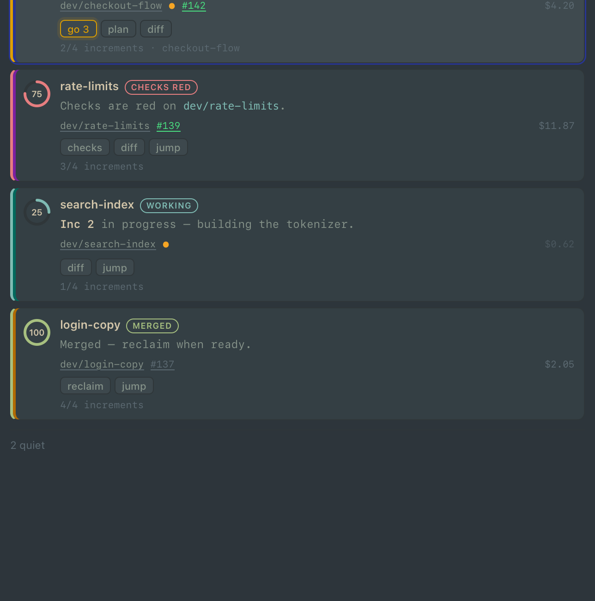

### Usage

Tokens against your 5-hour and weekly budgets, a 21-day history, and dollars
per workspace, so a worktree that is quietly burning money stands out.

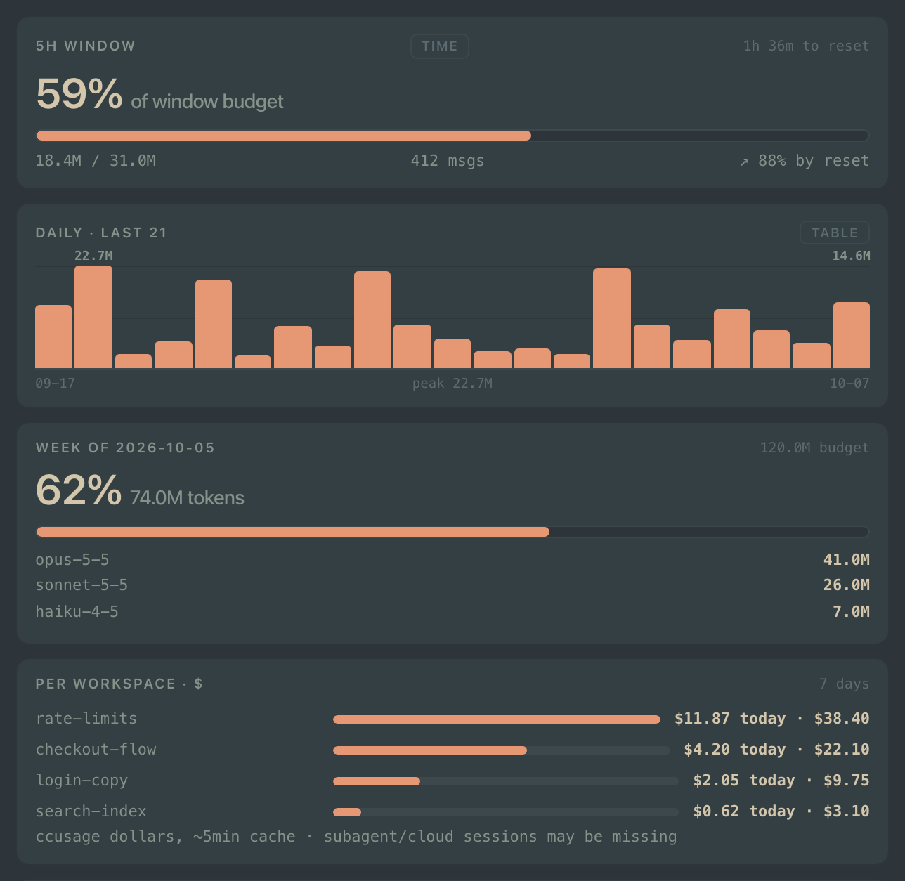

### Cache

Every prompt uses a server-side cache. When it expires, the next prompt
writes your whole context back into it at a premium. Most expiries are a
session left idle past the cache's lifetime (five minutes or an hour,
depending on how you pay), and you normally don't notice until the bill.
crew makes it visible:

- The status line shows a freshness clock (`🧊 42m`).
- A desktop notification fires a minute before an idle session goes stale.
- When a turn does break the cache, you're told right away how many tokens
  were re-cached and why (compaction, a model switch, an idle gap).
- `/usage` keeps the weekly tally: re-cached tokens, their causes, and the
  sessions that cost the most.

Detection reads your local transcripts, not the API, and the cache lifetime
comes from your billing mode and settings.

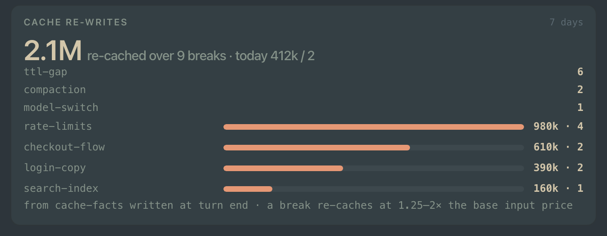

What to do with a warning:

- A break you already took is a sunk cost. You only pay for the re-cache if
  you prompt again, so a session that was nearly done can just lapse.
- A cold cache is the cheap time for disruptive changes like switching
  model, toggling a plugin or upgrading, since each of those breaks the cache
  anyway.
- Answer a stale warning only with a prompt you meant to send. A cache read
  costs about a tenth of the normal input price and a write up to double, so
  sending your next real step a minute early is nearly free. Prompting just
  to keep the cache warm spends real tokens to protect hypothetical ones.

## deep-plan: plans you approve one step at a time

You ask for a plan. deep-plan makes the agent work through it in this order:

1. **Question the goal.** The agent restates the goal, lists its
   assumptions, and gives you the strongest argument against it: a simpler
   fix, a different cause, or not doing it at all. This step is mandatory
   unless you tell the agent to skip the challenge.
2. **Ask about the forks.** Every decision that is hard to undo comes to you
   as a question before anything is written down.
3. **Check what it doesn't know.** Cheap sub-agents look into each claim the
   agent isn't sure of and each contract the plan touches. What they confirm
   becomes a cited fact; the rest stays listed as a risk.
4. **Render the plan as a page** with a short quiz (below).
5. **Gate the work.** The agent can't edit the worktree until the quiz
   passes and you say `go`. Each `go` opens one increment, and each
   increment must pass its checks before it can be marked done.

### The review page

The page has the plan's context, decisions, cited evidence, diagrams and
increments.

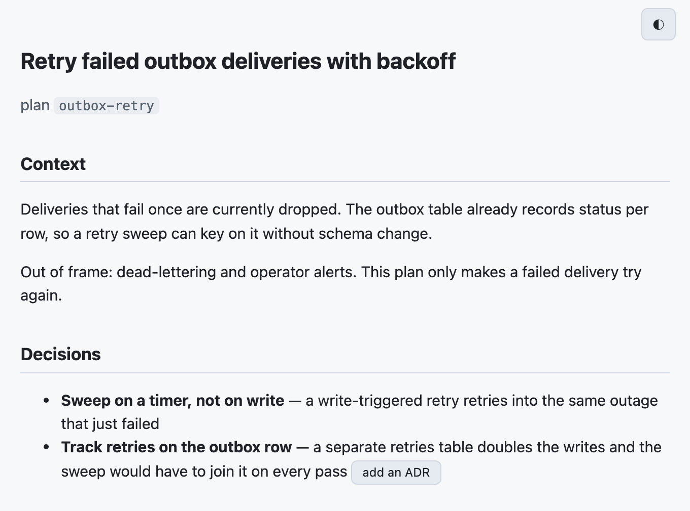

At the bottom is a short quiz that checks that you and the plan agree.
Answer on the page, highlight text anywhere to pin comments, then click
**Copy for session** and paste the result back into the terminal.

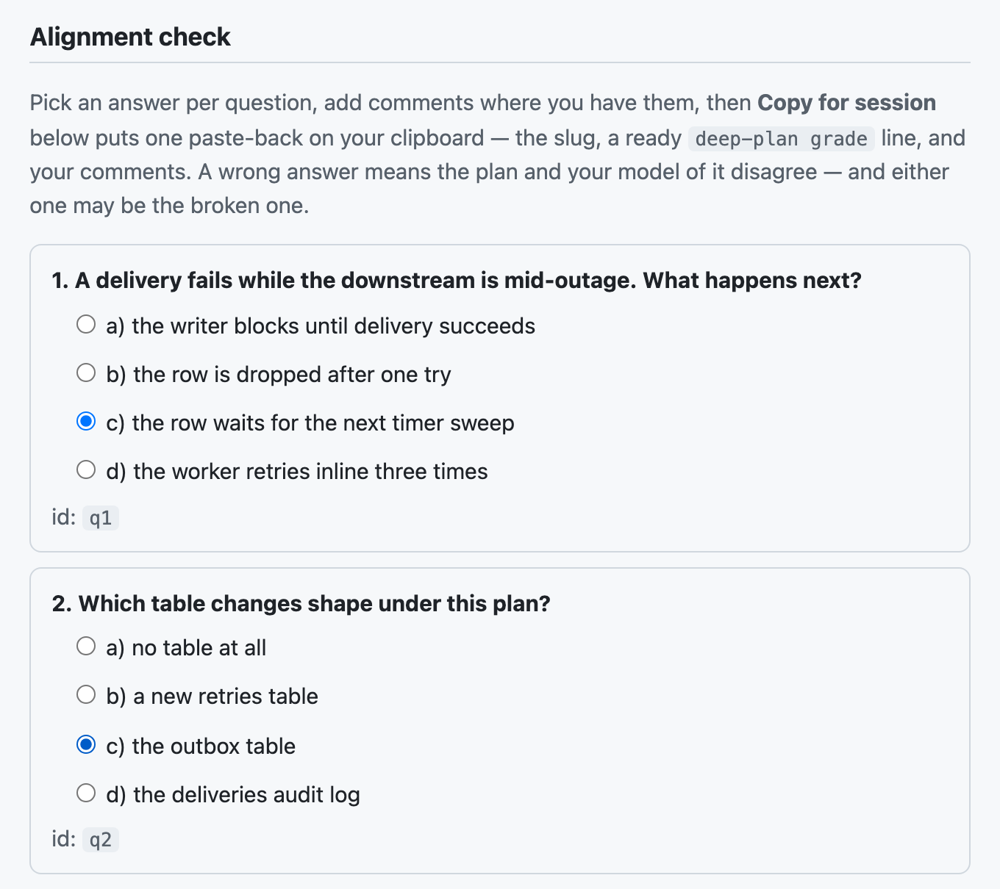

### Questions with pictures

Some decisions are about shape, like what a logged-out visitor sees behind a
share link. Those are slow to describe in words, so `deep-plan ask` puts the
question on a page, with a diagram and a sample payload for each option, next
to the terminal in the Dock.

The terminal prompt is still the answer of record. If you pick on the page,
the intent server types your choice into that terminal and reads the screen
back to confirm it landed; if it can't confirm, it tells you which key to
press. Asks work without a plan in progress.

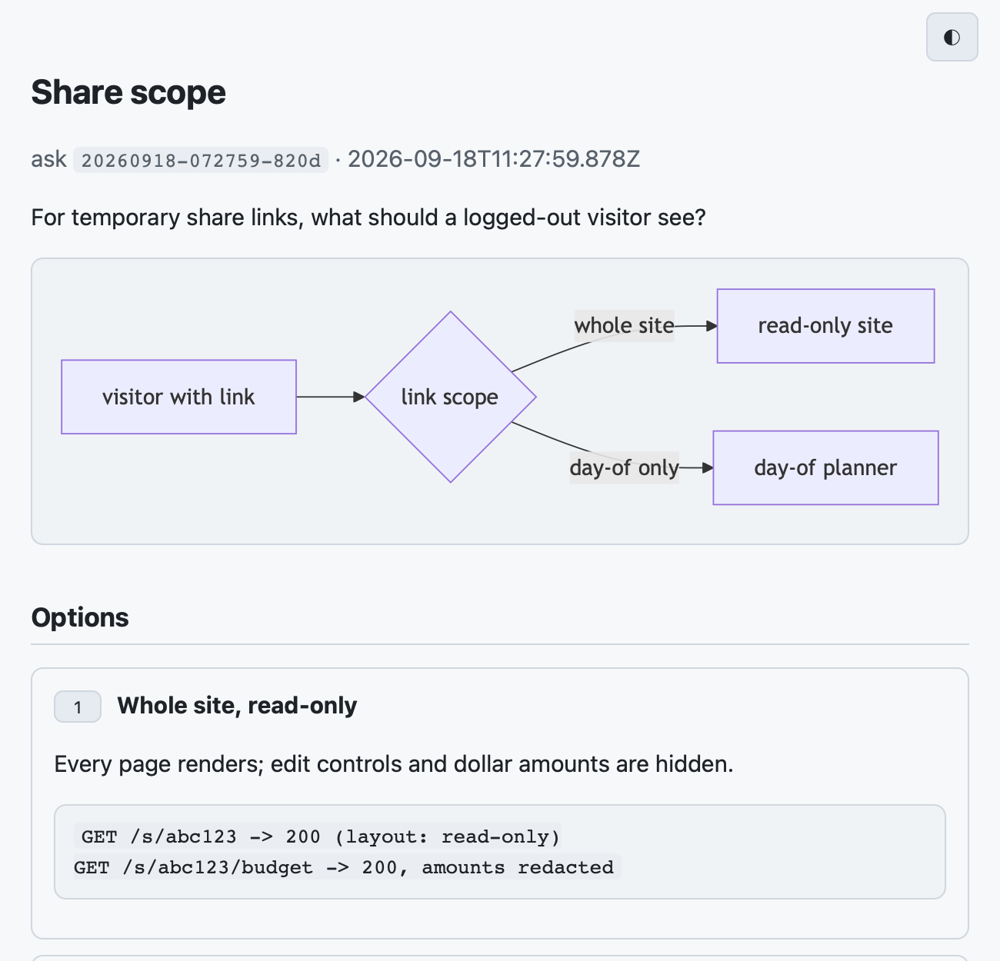

### Contracts

If a plan changes the shape of anything (a schema, an API, a method
signature, an event, a config surface), it has to declare it in the spec's
`contracts` block. Each entry names the decision that owns it, and the
renderer refuses an entry with no owner. Each entry also lists who uses that
surface, found by looking at the code rather than recalled from memory.

A contract that crosses a service boundary needs more: its decision must be
an ADR, or the entry must carry a written waiver. `deep-plan grade` also
fails, before reading any answers, if a contract's decision has no quiz
question.

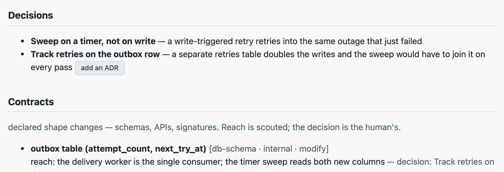

### Risks

A risk is a claim nobody could cite. The review page asks what you want to do
about each one:

- **accept** it,
- **mitigate** it, by naming the increment that handles it or a ticket you
  filed,
- **spike** it, by saying what check would settle it, or
- **promote** it into the quiz, so the review can't pass until you've been
  asked about it.

Your choices go back with the same **Copy for session** paste as your quiz
answers. `deep-plan grade` refuses while any risk is undecided, just as it
refuses a contract change with no quiz question.

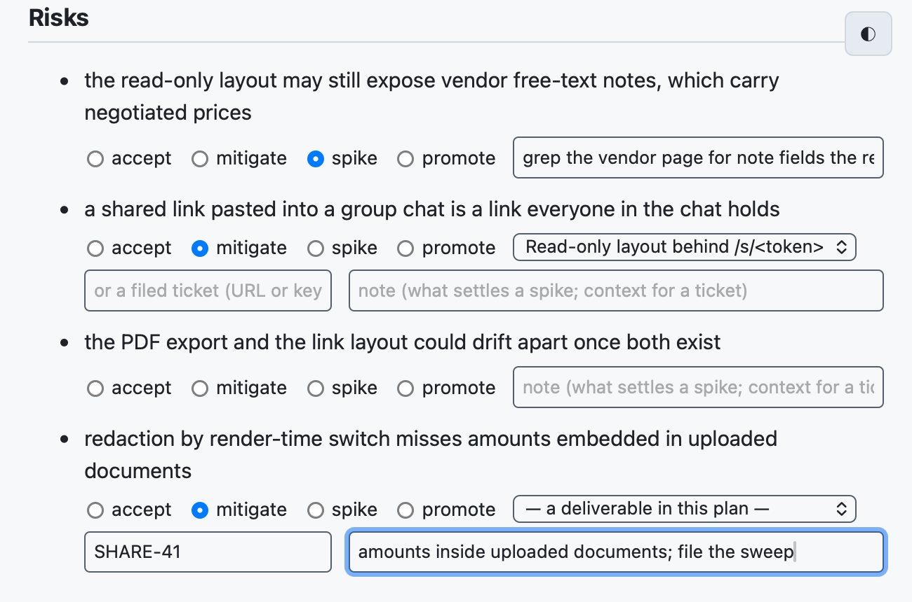

### ADRs

Some decisions outlive the plan. Flag one as `adr` during planning and it
becomes an Architecture Decision Record for the repo, not just a note on the
plan page.

The renderer picks where it goes: your `.seamux/adr.json` if you have one,
otherwise the ADR folder nearest the files being changed, otherwise
`docs/adr`. It also reserves the next number, so the draft shows its real
destination from the start.

Each ADR card has an **Edit** button with a live preview, and edits go back
with the same **Copy for session** paste. An unflagged decision gets an **add
an ADR** button.

The repo isn't touched until the quiz passes and you run `deep-plan adr apply
<slug>`, which marks each record Accepted and dated, and is safe to run twice.
`.seamux/adr.json` can switch the style from Nygard to MADR or your own
template. If your ADRs are named like `adr_013_snake_case.md`, its
`filePattern` and `numberScan` keep new records in your numbering.

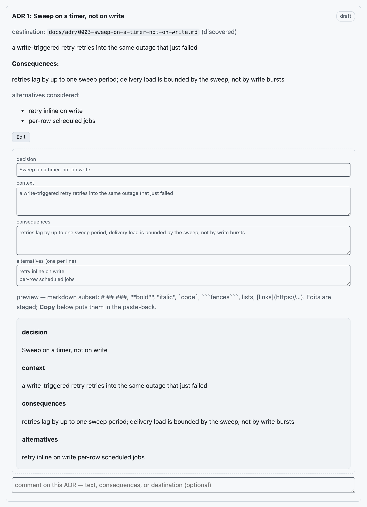

### Checks before done

Every increment has checks: a test suite, an e2e run, an observability
signal, or a step a person performs. `done` is refused until each check has
passed against the code being closed.

You rarely write checks by hand. Each project keeps recipes in
`.seamux/verify.json` next to its code; in a monorepo a file uses the nearest
one and inherits the root's. Any recipe marked `default` whose globs cover an
increment's files becomes one of its checks. The review page shows exactly
what will run, and an increment with no checks is refused unless the plan
says in writing why nothing can prove it.

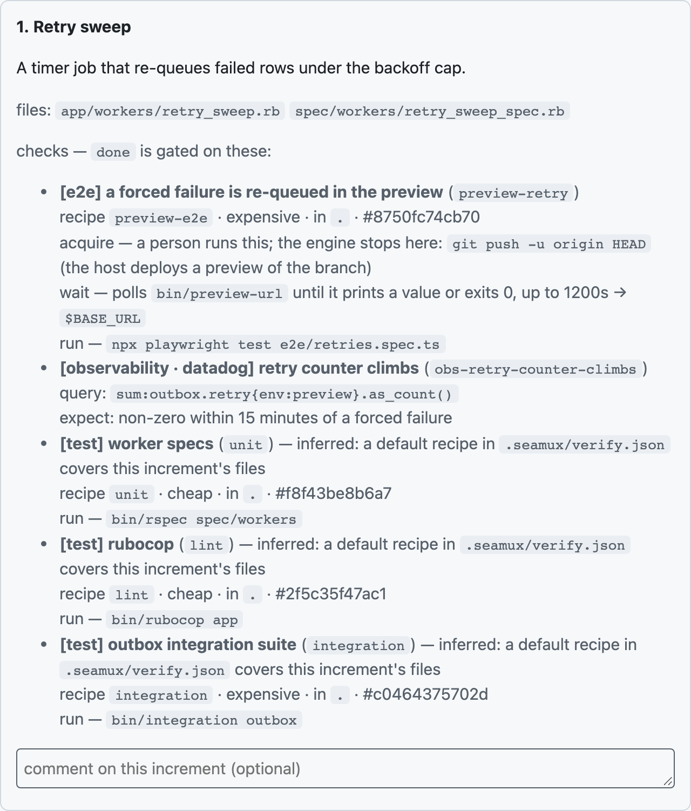

`deep-plan check run` runs them and takes each verdict from the exit code.
Quick checks run in the foreground; slow ones run in a background runner that
records its own verdict. Remote QA is three steps: get a preview, wait for it,
test it. Getting the preview (a push, a channel deploy) is always your step:
the engine prints what to run and picks up from the wait once you have.

A pass belongs to the code it ran against. Edit a file afterwards and it goes
stale; commit what passed and it stays valid. With seamux-mods, the plan pane
lists the same checks with `run checks` and `variant ready` buttons.

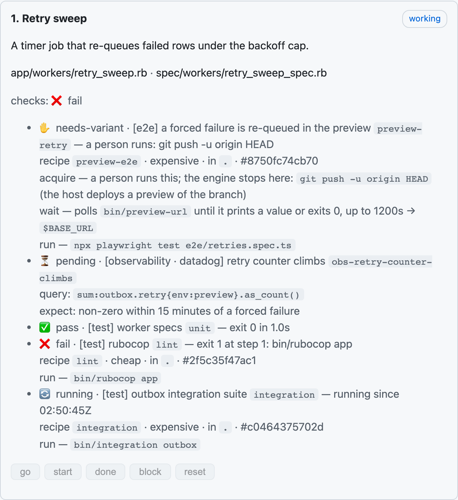

```text
$ deep-plan done outbox-retry 1
deep-plan: increment 1 has 4 check(s) outstanding:
  ✋ preview-retry  [e2e] needs-variant — a person runs: git push -u origin HEAD
  ⏳ obs-retry-counter-climbs  [observability] pending
  ❌ lint  [test] fail — exit 1 at step 1: bin/rubocop app
  🔄 integration  [test] running — running since 02:50:45Z

  what each one runs:  deep-plan check list outbox-retry 1
  record a verdict:    deep-plan check pass|fail outbox-retry 1 <id> "<what you saw>"
  override, logged:    deep-plan done outbox-retry 1 --force

done refused: preview-retry needs-variant (a person runs: git push -u origin HEAD); obs-retry-counter-climbs pending; lint fail (exit 1 at step 1: bin/rubocop app); integration running (running since 02:50:45Z)
```

### Setting up checks

With no recipes yet, `deep-plan verify init` reads what the repo already
runs (package.json scripts, CI steps cited by line, test-runner configs, the
host it deploys to) and drafts a recipe file per project with a TODO on every
gap. It writes only with `--write`, and never over an existing file. Remote
QA templates cover Vercel previews, Firebase channels, RWX runs and GitHub
deployments, each marked unverified until proven against a real preview.
`deep-plan/verify/setup-prompt.md` then walks the TODOs with you: check each
command against CI, run it twice from a clean tree, and time it.

```text
$ deep-plan verify init
project . (package.json) — runners: playwright, vitest
  draft .seamux/verify.json
    lint           test · cheap · default  npm run lint
      evidence: .github/workflows/ci.yml:9
      TODO confirm it matches CI: .github/workflows/ci.yml:9
      TODO run it twice from a clean tree; both must pass and leave git status clean
      …
    test-e2e       e2e · expensive  npm run test:e2e
      TODO no CI step runs this — confirm it is the command a reviewer would trust
      TODO its Playwright config starts its own webServer: a local e2e. For a deployed
           preview, make it honour $BASE_URL and add a remote template
      …
    (check chains lint, type-check, test — its parts are recipes; it is not one)
    host: vercel → remote QA template: deep-plan verify init --template vercel-preview
```

## restack: rebase without merging generated files

A stack that sits for a few days picks up two kinds of conflict. One is your
code against someone else's, which needs a person. The other is a checked-in
generated file (a GraphQL dump, a Rails schema, a generated client) that
conflicts the same way on every branch. Merging that by hand means editing a
program's output, and CI tells you twenty minutes later that it's out of
date.

restack handles the second kind. A per-repo `.seamux/restack.json` lists each
generated file, the command that rebuilds it, and whether rebuilding is cheap
(a code generator) or expensive (a container, a migrated database).

- `restack run` walks the stack from the bottom, resolves each generated-file
  conflict by regenerating it, and **stops only for conflicts a person needs
  to resolve**. It exits with code 2 and lists the files with a hunk count
  for each, instead of dumping git output.
- A file too expensive to rebuild mid-walk is set to the base's copy and
  marked **stale**, along with the command that fixes it. `restack check` and
  `restack push` refuse while anything is stale, so a half-merged schema
  never ships unnoticed.
- `restack check --deep` runs the staleness and breaking-change comparisons
  locally against a freshly fetched base, before you push.
- `restack push` only prints the push commands; a person runs them. A
  restacked stack can only go up with a force push, and seamux's Bash guard
  deliberately blocks those from agents.

```sh
restack plan --json      # what will be restacked, which artifacts will collide
restack run              # the walk; exit 2 means something needs you
restack continue         # after you resolved it
restack check --deep     # the CI comparisons, locally
restack push             # prints; never pushes
```

Here is a two-branch stack after `main` moved. Both sides added GraphQL
types, so the generated `schema.graphql` conflicts, and both changed the tax
rate in `app/billing.rb`. restack regenerates the schema and stops only for
the tax rate:

```text
$ restack plan
plan · git rebase --onto, bottom first · base origin/main (1 behind)
  • feat/invoices — 1 commit(s) onto origin/main
  • feat/invoice-emails — 1 commit(s) onto feat/invoices

  generated artifacts both sides touched (conflicts expected, and handled):
    graphql-schema — resolve regen, cheap

$ restack run
  rebasing feat/invoices onto origin/main

stopped on feat/invoices at 1/1 — invoices: Invoice type, tax from the rate table
  resolved for you (generated):
    graphql-schema — regenerated (1 file)
  yours to resolve:
    app/billing.rb — 1 hunk

  then: restack continue

$ git add app/billing.rb && restack continue
  rebasing feat/invoice-emails onto feat/invoices

  ok   feat/invoices b5481eab7428
  ok   feat/invoice-emails b355d0a6a178

$ restack check
  staleness: graphql-schema …
  ok   graphql-schema

$ restack push
  run these yourself (the stack must go up bottom-first):
    git push --force-with-lease origin feat/invoices
    git push --force-with-lease origin feat/invoice-emails
```

If you use Graphite, restack leaves the rebase to `gt restack` and does its
resolving between Graphite's stops. Without Graphite, it finds the chain from
your open PRs or from branch topology.

## seamux-mods: deep-plan in the terminal

An optional plugin that draws deep-plan inside Claude Code, so you can steer
a plan without leaving the session. It needs Claude Code 2.1.287 or later;
install it with `./install.sh --mods`.

`/plan-pane` opens a pane with the plan's increments and each one's checks,
with buttons for `go next`, `done`, `run checks` and `variant ready`. The
status line under the prompt shows the plan's progress, the open increment,
and how many checks are running in the background.

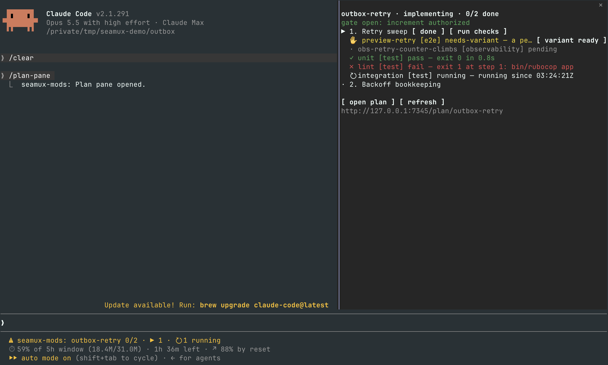

When the gate blocks an edit, a band appears above the prompt with the
reason and a `go next` button, so approving the next increment is one key
away.

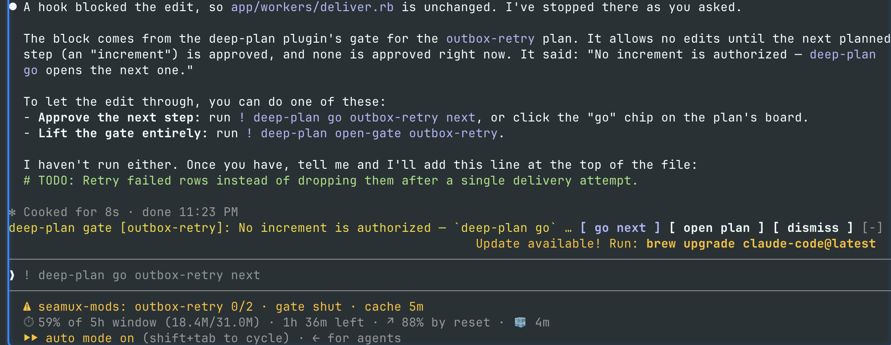

## Setup

### Install or update with an agent

If you're an agent setting this up for someone, follow these steps in order.
Stop and ask the person wherever a step says to.

**First install**

1. Clone to the checkout the person will keep, such as `~/code/seamux`.
   Never install from a git worktree: the plugins run from the folder you
   install from, and break when that folder is removed.
2. Ask the person which parts they want (all four plugins, or just
   deep-plan, restack or crew), and whether they use Jira, GitHub Issues, or
   Datadog, Splunk or Grafana. For crew, also ask which repo their worktrees
   come from. Don't guess any of these; leaving them off is fine.
3. Preview with `./install.sh --dry-run` plus the flags from step 2
   (`--no-crew`, `--mods`, `--with-jira=SITE`, `--main-repo PATH`; see
   [Install](#install)), then run the same command without `--dry-run`.
4. Verify with `./install.sh --check` and, if crew is installed, `crew
   doctor`. Both must be clean.
5. Tell the person to start a new Claude Code session. Running sessions
   don't pick up the plugins' hooks. Slash commands like `/plugin` and
   `/reload-plugins` are theirs to type, not yours.

**Update**

1. In the checkout the plugins run from (`claude plugin list` shows it),
   run `git pull --ff-only`.
2. Run `./install.sh` again. It's safe to re-run, and it re-applies crew.
3. Run `./install.sh --check` and `crew doctor`, then ask the person to run
   `/reload-plugins` in open sessions.

An install made with `--github` runs a cached copy instead, and updates only
when a plugin's version changes.

**Don't:** edit `~/.config/cmux/crew` directly (`crew apply` overwrites it;
machine-local changes go in `~/.config/cmux/crew-local`), put tokens or keys
in this repo or a `.seamux/` file (integrations read them from the
environment), or push anything.

### What you need

| | why | without it |
|---|---|---|
| macOS | cmux and the Dock are Mac-only | nothing works |
| [cmux](https://cmux.io) nightly | the board lives in cmux's web Dock | files install, nothing shows |
| `python3` + `node` | board, intent server, probes, deep-plan | install refuses |
| Claude Code | the agents this is all for | not much point |
| `gh` *(optional)* | PR and checks chips on rows | those chips stay blank |
| `ccusage` *(optional)* | spend on rows and `/usage` | cost surfaces are absent |
| [TypeSafe](https://typesafe.ai) key *(optional)* | judgment calls: turn-end questions, board ranking, plan citation checks | those judgments don't happen |

deep-plan and restack alone need only Claude Code and `node`; the macOS and
cmux rows are for crew.

### Install

```sh
git clone https://github.com/rickykoter/seamux ~/code/seamux
cd ~/code/seamux
./install.sh
```

`install.sh` is a thin wrapper around `claude plugin`. It:

1. adds this checkout as the `seamux` marketplace,
2. installs deep-plan, restack, bash-guard and crew (add `--mods` for
   seamux-mods),
3. runs each engine's `setup`, which downloads a pinned, checksum-verified
   `mermaid.min.js` and puts `deep-plan` and `restack` on your PATH,
4. runs `crew apply`.

Because the marketplace is a folder, the plugins run straight from this
checkout. Edit a file, run `/reload-plugins` in a session, and the change is
live; there is no version to bump. `--github` installs the published copy
from GitHub instead.

To install without the script, from inside Claude Code:

```text
/plugin marketplace add rickykoter/seamux
/plugin install deep-plan@seamux
```

then run `deep-plan setup` (and `crew apply` if you installed crew).

On a machine set up by the old installer, the first run migrates it. The
`~/.claude/skills` copies, their shims, and the `settings.json` hook entries
the plugins now carry are moved into `~/.claude/seamux-migrated/<time>/`.
Nothing is deleted, and each item moves only once the plugin replacing it is
installed and enabled. `--dry-run` prints every command and the migration
list without changing anything.

For scripted installs, `--main-repo PATH`, `--with-jira=SITE`,
`--with-github-issues` and `--with-observability=STACK` set the crew plugin's
options, and `--no-crew`, `--no-restack` and `--no-guard` skip plugins.

### Integrations

All of these are optional.

| integration | what you get | turn it on |
|---|---|---|
| Jira | A ticket key in your branch name becomes a chip on the row, colored by the ticket's state. Click it to open the ticket. `crew doctor` checks `acli` only if this is on. | crew plugin option |
| GitHub Issues | The issue a PR closes (or a `123-…` branch names) gets its own chip, using the `gh` poll crew already makes. | crew plugin option |
| Datadog, Splunk or Grafana | deep-plan reads your monitors, dashboards and runbooks before drafting a plan. What exists gets cited; what's missing becomes plan work, like new instrumentation, a monitor definition you import, or a runbook section. It only reads: changes come as files you review and apply, never as API writes. | crew plugin option `observability_stack`, or a per-repo `.seamux/observability.json` |
| TypeSafe | Three judgment calls plain code can't make (below). | a key in `$TYPESAFE_API_KEY` or the first line of `~/.config/typesafe/api-key` |

Set the crew plugin's options with `/plugin` inside Claude Code, or `claude
plugin configure crew@seamux`. If you skip them, nothing nags you and no
chips sit empty.

**TypeSafe** isn't asked about at setup. A key on the machine turns it on and
removing the key turns it off. It answers three questions:

- When a turn ends on "should I do A or B?", crew files the row under "Needs
  you" instead of treating it as finished.
- The board learns which rows matter most. A session stuck on an error it
  couldn't get past drops in rank, and rows in the same tier are ordered by
  how urgently the last message needs you.
- When deep-plan renders a plan, each cited `path:line` is checked against
  the file it names, and a citation that contradicts its claim gets a
  warning.

TypeSafe answers in the background, so nothing waits on the network, and on
any failure everything behaves as it would without it. What leaves the
machine is the last 4,000 characters of a finished turn's closing message, or
a plan claim with the few lines it cites. Thresholds live in
`integrations.json`, scores are logged to `~/.cache/cmux-crew/asked.log`,
and `{"typesafe": {"enabled": false}}` turns it off with the key in place.

### Check it worked

```sh
./install.sh --check                             # plugins, leftovers, crew drift
crew doctor                                      # everything green
claude plugin list                               # each plugin, "Read from" this checkout
node deep-plan/probe.mjs && node restack/probe.mjs && node crew/board/board_probe.mjs
```

Open the board with `cmux sidebar open crew` or the Dock button. New Claude
Code sessions pick up the plugins' hooks; sessions already running don't.

Then ask Claude for a "deep plan" of any change. You'll get the review page,
the quiz, and the per-increment gate. In a repo with no `.seamux/verify.json`
yet, `deep-plan verify init` shows the checks it would draft.

### Uninstall

```sh
./install.sh --uninstall
```

This puts cmux's config back, moves the crew folder to a timestamped backup,
uninstalls the plugins, and removes the marketplace and the shims. It keeps
your plan state (`~/.claude/deep-plan`, `~/.claude/plans`), each repo's
`.seamux/restack.json`, and `~/.config/cmux/crew-local`.

## Configuration

### Edits go live from the checkout

Claude runs deep-plan, restack, bash-guard and seamux-mods straight from this
checkout, so there is nothing to sync: edit, then `/reload-plugins`.

crew is the exception. cmux, launchd and the board run it from
`~/.config/cmux/crew`, a path that never moves, so `crew apply` copies the
plugin there. `crew doctor` compares the two copies every time, so drift
shows up as a failed check. (The five `crew/bin` files that contain your
main-repo path are compared with that path swapped back to
`__MAIN_REPO__`.)

### Usage-based billing

By default the board, `/usage` and the status line assume a subscription,
where the limit that matters is the 5-hour window and money isn't the
question. If you pay per token, there is no window limit and the monthly
spend is what matters. Set:

```json
// ~/.config/cmux/crew-local/config.json
{ "billing": "usage", "monthBudget": 3500 }
```

The status line then shows month-to-date spend against that budget with a
pace figure, and `/usage` leads with the month and uses dollars instead of
tokens. Without the file, nothing changes.

It's a file because the status line and intent server never read your shell
startup files (see `crew/board/README.md`). `CREW_BILLING` and
`CREW_MONTH_BUDGET` override it for a one-off, and `crew doctor` reports the
active mode.

### Your machine-local files

Two things are yours and are never synced:

- `integrations.json`
- the overlay at `~/.config/cmux/crew-local`: an executable `crew-spec`,
  plus `cmux.json` and `dock.json` fragments that are deep-merged over the
  package's templates. That's the place for a company test harness or a
  private repo's color, and it survives every reinstall.

`docs/SYNCING.md` covers the rest: which path belongs to whom, and the traps
that have actually caused problems (`--main-repo` must be expanded by the
shell; a dry run can't prove the path substitution; `crew apply` takes no
backup once it has run on a machine). It also lists what to check before
installing over a live setup that has files the repo never had.

### Computer Use (optional)

cmux's Computer Use driver lets agents operate the browser and other apps in
the background. crew works without it; `crew doctor` just reports whether
it's set up.

1. In the cmux desktop app, open **Settings → Computer Use** (or the
   onboarding banner). A half-finished setup shows up to agents as "Computer
   Use onboarding is still in progress".
2. Approve the two macOS permission prompts for the cmux helper,
   **Accessibility** and **Screen Recording**, from cmux's own dialogs. If you
   dismissed one earlier, turn it on in System Settings → Privacy &
   Security. Restart cmux if Screen Recording doesn't take effect.
3. Finish the wizard's self-test, then run `crew doctor` again.

## Security notes

Read these before you rely on seamux.

- **The deep-plan gate is a discipline tool, not a security boundary.** It
  blocks the normal ways an agent edits files, so the agent can't get ahead
  of your go-ahead. A determined process, or a determined agent, can get
  around a PreToolUse hook. Use the gate to keep honest work honest, not to
  contain something you don't trust.
- **`crew-sandbox` copies your Claude login out of the macOS Keychain into
  the sandbox as a plaintext `.credentials.json`.** That's the only way a
  sandboxed session can be signed in, and it's deliberate, but it's a real
  trade-off. Anything that can read that sandbox's files can read the token,
  and a token rotated inside the sandbox doesn't update the Keychain copy.
  Skip the sandbox feature if that bothers you.
- **The board's intent server listens only on `127.0.0.1`** and requires a
  per-boot token (file mode 0600) on every request that changes anything.
  Any local process running as you can read that token, but such a process
  could drive cmux directly anyway. Don't expose the server beyond
  localhost.

## Layout

| path | what |
|---|---|
| `CLAUDE.md` | where an agent installing, updating or changing seamux should start |
| `.claude-plugin/marketplace.json` | the `seamux` marketplace, one entry per plugin below |
| `deep-plan/` | plugin: the skill, its gate hook and `bin/deep-plan` (see its `SKILL.md`); `verify/` holds the remote QA templates and the setup prompt |
| `restack/` | plugin: the skill and `bin/restack` (see its `SKILL.md`) |
| `bash-guard/` | plugin: blocks destructive commands on every Bash call |
| `crew/` | plugin: Claude hooks and options; `crew apply` copies it to `~/.config/cmux/crew` (see `crew/README.md`) |
| `crew/claude/` | the status line, and the settings merge `crew apply` runs |
| `seamux-mods/` | optional plugin: deep-plan drawn in the terminal (see its `README.md`) |
| `docs/` | dev history, test notes, adoption audit, ADRs and README images; not installed |
| `docs/SYNCING.md` | who owns which path, and how a change moves between the repo and your machine |
| `tools/scrub_check.py` | refuses internal identifiers in tracked files; the first step in CI |

Never committed: rendered cmux configs, deep-plan state and keys, the mermaid
file, and your `~/.claude/settings.json`.
